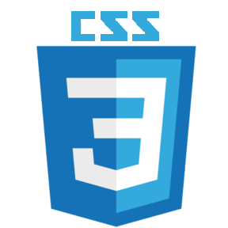
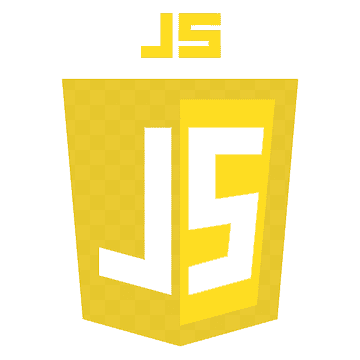
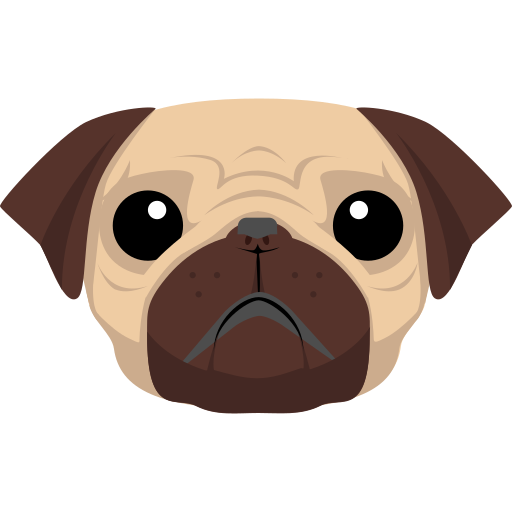
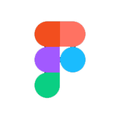
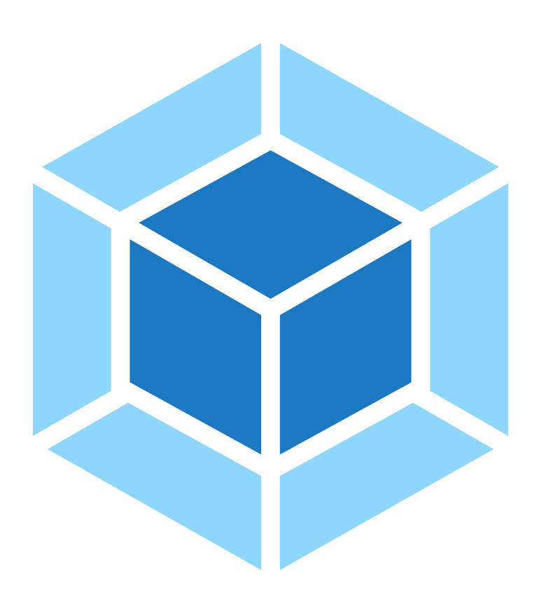

<!-- <h1>IRYNA IELKINA</h1> -->
<!-- <h2>
  
  Hey there
</h2> -->

<!-- Welcome to my GitHub! I'm a Junior QA Manual Engineer with a technical background in front-end development. I love clean documentation, structured testing, and continuous learning.
🧪 QA Manual Engineer
Skilled in Jira, Trello, TestRail, Postman, DevTools, DBeaver, MySQL
Familiar with Agile/Scrum, API testing, and bug reporting
Passionate about improving product quality and supporting team processes
📂 About Me and My Practice Tasks
Here you'll find:
Practice projects from QA courses
Bug reports, checklists, and test documentation
UI and API testing examples
Translations and formatting experiments in English, Ukrainian, and Russian -->

<!-- 📝 Summary Detail-oriented, collaborative, and result-driven Fluent in three
languages for technical and everyday communication Always exploring new tools
and productivity methods Seeking opportunities to contribute and grow in a
dynamic QA team

SUMMARY     I am a Junior QA Engineer with a quality-first mindset and a
passion for building intuitive, bug-free digital products. Experienced in manual
testing, writing test cases, and reporting bugs using tools like Jira, TestRail,
and Postman. Detail-driven, analytical, and quick to grasp new technologies.
Contributed to testing web and mobile applications in training projects, aiming
to apply skills in real-world scenarios and grow toward automation.
Collaborative, receptive to feedback, and committed to delivering reliable
results. -->

<!-- <a href="https://www.canva.com/design/DAGTE72WEQA/53Hz1Nr9pNbtbpBdY6bDMw/view?utm_content=DAGTE72WEQA&utm_campaign=designshare&utm_medium=link&utm_source=editor">Summary</a> -->
<!--
**ielkina/ielkina** is a ✨ _special_ ✨ repository because its `README.md` (this file) appears on your GitHub profile.

Here are some ideas to get you started:

- 🔭 I’m currently working on ...
- 🌱 I’m currently learning ...
- 👯 I’m looking to collaborate on ...
- 🤔 I’m looking for help with ...
- 💬 Ask me about ...
- 📫 How to reach me: ...
- 😄 Pronouns: ...
- ⚡ Fun fact: ...
-->

<!-- ## Portfolio -->

<!---->

## Tech skills and Tools

  

  <!--  -->

  <!--  -->

  <!--  -->

  <!--  -->

  <!--  -->

  <!--  -->

  <!--  -->

  <!--  -->

  <!--  -->

  <!--  -->

  <!--  -->

  <!--  -->

  <!--  -->

  <!--  -->

  <!--  -->

  <!--  -->

  <!--  -->

  <!--  -->

  

 

<!-- ## Languages -->

<!--  -->

<!-- ## Stats -->

<!--  -->

<!--  -->

<!-- ## Helpful YouTube Channel/Videos -->

<!-- [https://www.youtube.com/@goitfrontend7563](https://www.youtube.com/@goitfrontend7563) -->

<!-- [www.youtube.com/@YauhenKavalchuk](https://www.youtube.com/@YauhenKavalchuk) -->

<!-- [https://www.youtube.com/@FreelancerLifeStyle](https://www.youtube.com/@FreelancerLifeStyle) -->

<!-- ## Follow Me -->

<!--  -->
<!--  -->
<!--  -->

<!--  -->
<!--  -->

<!--  -->

<!--  -->

<!--  -->
<!--   -->

<!--  -->

<!-- in your header -->
<!-- <link rel="stylesheet" href="https://cdn.jsdelivr.net/gh/devicons/devicon@latest/devicon.min.css"> -->

<!-- in your body -->
<!-- <i class="devicon-devicon-plain"></i> -->

<!-- # Приветствие  🦕 -->

<!-- 

 -->

<!-- Блок о себе. Здесь можно написать все то, что описывает вас как специалиста

_Пример_

_Меня зовут Роберто. Я QA Enginner - cильный специалист в области средств массовой информации и коммуникаций со степенью бакалавра технологий в области компьютерных наук и инженерии. Я специализируюсь на тестировании API и мобильных приложений_ -->

<!-- ## My CV

[Здесь будет сслыка на резюме](https://ссылочку_сюда) -->

<!-- ## Портфолио
- Тестовая документация
  -  [Чек-листы](https://ссылочку_сюда)
  -  [Тест-кейсы](https://ссылочку_сюда)
  -  [Mind maps](https://ссылочку_сюда)
  -  [Баг-репорты](https://ссылочку_сюда)
- Коллекция в Postman
  -  [Название проекта](https://ссылочку_сюда)
- SQL запросы
  -  [Название проектв](https://ссылочку_сюда) -->

<!-- ## Инструменты и технологии
Блок для инструментов. Вы можете использовать мои иконки или создать папку у себя в проекте -->

<!-- 

 -->

<!-- ## Мои контакты -->

<!--  -->

<!--  -->
